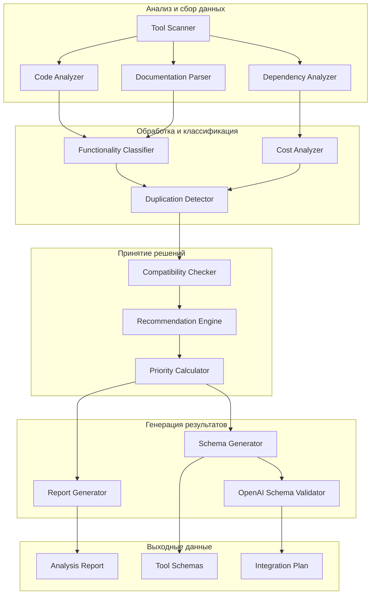

# Design Document: CrewAI Tools Integration Analysis

## Обзор

Система анализа CrewAI инструментов представляет собой комплексное решение для автоматизированного анализа библиотеки инструментов с целью выбора оптимального набора для интеграции в GopiAI. Система использует статический анализ кода, парсинг документации и эвристические алгоритмы для принятия решений.

## Архитектура

### Компонентная диаграмма



## Компоненты и интерфейсы

### 1. Tool Scanner (Сканер инструментов)

**Назначение:** Обнаружение и каталогизация всех инструментов в библиотеке CrewAI.

**Интерфейс:**
```python
class ToolScanner:
    def scan_tools_directory(self, path: str) -> List[ToolInfo]
    def extract_tool_metadata(self, tool_path: str) -> ToolMetadata
    def get_tool_categories(self) -> Dict[str, List[str]]
```

**Функциональность:**
- Рекурсивное сканирование директории `tools/`
- Извлечение метаданных из Python файлов
- Определение структуры наследования классов
- Группировка по функциональным категориям

### 2. Code Analyzer (Анализатор кода)

**Назначение:** Статический анализ кода инструментов для извлечения функциональной информации.

**Интерфейс:**
```python
class CodeAnalyzer:
    def analyze_tool_class(self, class_path: str) -> ToolAnalysis
    def extract_parameters(self, method_signature: str) -> List[Parameter]
    def detect_external_dependencies(self, imports: List[str]) -> List[Dependency]
    def analyze_functionality(self, code: str) -> FunctionalityProfile
```

**Функциональность:**
- AST парсинг Python кода
- Извлечение сигнатур методов и параметров
- Анализ импортов и зависимостей
- Определение основной функциональности

### 3. Documentation Parser (Парсер документации)

**Назначение:** Извлечение информации из docstrings и README файлов.

**Интерфейс:**
```python
class DocumentationParser:
    def parse_docstrings(self, tool_class: type) -> DocInfo
    def parse_readme(self, readme_path: str) -> ReadmeInfo
    def extract_usage_examples(self, doc_text: str) -> List[Example]
    def identify_api_requirements(self, doc_text: str) -> List[ApiRequirement]
```

**Функциональность:**
- Парсинг docstrings с извлечением описаний
- Анализ README файлов
- Поиск примеров использования
- Выявление требований к API ключам

### 4. Dependency Analyzer (Анализатор зависимостей)

**Назначение:** Анализ внешних зависимостей и их стоимости.

**Интерфейс:**
```python
class DependencyAnalyzer:
    def analyze_imports(self, tool_path: str) -> List[ImportInfo]
    def check_api_requirements(self, tool_info: ToolInfo) -> ApiRequirements
    def classify_cost_model(self, dependency: str) -> CostModel
    def detect_conflicts(self, dependencies: List[str]) -> List[Conflict]
```

**Функциональность:**
- Анализ импортов и внешних библиотек
- Определение требований к API ключам
- Классификация по модели оплаты (бесплатно/freemium/платно)
- Выявление конфликтов зависимостей

### 5. Functionality Classifier (Классификатор функциональности)

**Назначение:** Категоризация инструментов по функциональным группам.

**Интерфейс:**
```python
class FunctionalityClassifier:
    def classify_tool(self, tool_info: ToolInfo) -> List[FunctionCategory]
    def detect_similar_tools(self, tools: List[ToolInfo]) -> List[SimilarityGroup]
    def calculate_functionality_overlap(self, tool1: ToolInfo, tool2: ToolInfo) -> float
```

**Функциональные категории:**
- **File Operations**: Работа с файлами и директориями
- **Web Scraping**: Извлечение данных с веб-сайтов
- **Search**: Поисковые возможности
- **Database**: Работа с базами данных
- **AI/ML**: Интеграция с AI сервисами
- **Communication**: Коммуникационные инструменты
- **Development**: Инструменты разработки

### 6. Cost Analyzer (Анализатор стоимости)

**Назначение:** Определение стоимостной модели каждого инструмента.

**Интерфейс:**
```python
class CostAnalyzer:
    def analyze_cost_model(self, tool_info: ToolInfo) -> CostModel
    def detect_api_key_requirements(self, code: str) -> List[ApiKeyRequirement]
    def classify_service_tier(self, service: str) -> ServiceTier
```

**Модели стоимости:**
- **FREE**: Полностью бесплатные
- **FREEMIUM**: Бесплатные с ограничениями
- **PAID**: Требуют платную подписку
- **CONDITIONAL**: Зависят от использования

### 7. Duplication Detector (Детектор дублирования)

**Назначение:** Выявление инструментов с похожей функциональностью.

**Интерфейс:**
```python
class DuplicationDetector:
    def find_duplicates(self, tools: List[ToolInfo]) -> List[DuplicationGroup]
    def calculate_similarity_score(self, tool1: ToolInfo, tool2: ToolInfo) -> float
    def recommend_best_tool(self, duplicate_group: DuplicationGroup) -> ToolInfo
```

**Критерии сравнения:**
- Функциональное сходство (70%+ overlap)
- Качество реализации
- Стабильность и поддержка
- Отсутствие платных зависимостей

### 8. Compatibility Checker (Проверка совместимости)

**Назначение:** Проверка совместимости с существующей системой GopiAI.

**Интерфейс:**
```python
class CompatibilityChecker:
    def check_existing_tools_overlap(self, tool: ToolInfo) -> OverlapAnalysis
    def validate_dependencies(self, tool: ToolInfo) -> CompatibilityResult
    def assess_integration_complexity(self, tool: ToolInfo) -> ComplexityScore
```

**Существующие инструменты для сравнения:**
- `execute_terminal_command`
- `browse_website`
- `web_search`
- `file_operations`

### 9. Recommendation Engine (Движок рекомендаций)

**Назначение:** Принятие решений о включении инструментов в финальный список.

**Интерфейс:**
```python
class RecommendationEngine:
    def generate_recommendations(self, analysis_results: AnalysisResults) -> List[Recommendation]
    def calculate_tool_score(self, tool: ToolInfo) -> ToolScore
    def apply_selection_criteria(self, tools: List[ToolInfo]) -> List[SelectedTool]
```

**Критерии отбора:**
1. **Стоимость** (40%): Предпочтение бесплатным инструментам
2. **Уникальность** (30%): Отсутствие дублирования функциональности
3. **Полезность** (20%): Ценность для GopiAI системы
4. **Техническая совместимость** (10%): Простота интеграции

### 10. Schema Generator (Генератор схем)

**Назначение:** Создание OpenAI-совместимых схем для выбранных инструментов.

**Интерфейс:**
```python
class SchemaGenerator:
    def generate_openai_schema(self, tool: ToolInfo) -> OpenAISchema
    def convert_parameters(self, params: List[Parameter]) -> Dict[str, Any]
    def generate_examples(self, tool: ToolInfo) -> List[UsageExample]
    def validate_schema(self, schema: OpenAISchema) -> ValidationResult
```

**Формат схемы:**
```json
{
    "type": "function",
    "function": {
        "name": "tool_name",
        "description": "Tool description",
        "parameters": {
            "type": "object",
            "properties": {...},
            "required": [...]
        }
    }
}
```

## Модели данных

### ToolInfo
```python
@dataclass
class ToolInfo:
    name: str
    class_name: str
    file_path: str
    description: str
    category: FunctionCategory
    parameters: List[Parameter]
    dependencies: List[Dependency]
    cost_model: CostModel
    examples: List[Example]
    compatibility_score: float
```

### AnalysisResults
```python
@dataclass
class AnalysisResults:
    total_tools: int
    free_tools: List[ToolInfo]
    paid_tools: List[ToolInfo]
    duplicate_groups: List[DuplicationGroup]
    recommended_tools: List[ToolInfo]
    integration_plan: IntegrationPlan
```

### Recommendation
```python
@dataclass
class Recommendation:
    tool: ToolInfo
    priority: Priority  # HIGH, MEDIUM, LOW
    rationale: str
    integration_complexity: ComplexityScore
    estimated_effort: int  # в часах
    dependencies_required: List[str]
```

## Обработка ошибок

### Стратегии обработки ошибок

1. **Graceful Degradation**: При ошибке анализа одного инструмента, продолжить с остальными
2. **Fallback Analysis**: Использовать упрощенный анализ при недоступности полной информации
3. **Error Reporting**: Детальное логирование ошибок для последующего анализа
4. **Validation**: Проверка корректности сгенерированных схем

### Типы ошибок

- **ParseError**: Ошибки парсинга кода или документации
- **DependencyError**: Проблемы с анализом зависимостей
- **ValidationError**: Ошибки валидации сгенерированных схем
- **FileSystemError**: Проблемы доступа к файлам

## Стратегия тестирования

### Unit Tests
- Тестирование каждого компонента изолированно
- Мокирование внешних зависимостей
- Проверка корректности алгоритмов классификации

### Integration Tests
- Тестирование взаимодействия компонентов
- Проверка полного цикла анализа
- Валидация сгенерированных схем

### End-to-End Tests
- Тестирование на реальной библиотеке CrewAI
- Проверка качества рекомендаций
- Валидация интеграционного плана

## Производительность

### Оптимизации
- **Параллельная обработка**: Анализ инструментов в параллельных потоках
- **Кэширование**: Сохранение результатов анализа для повторного использования
- **Инкрементальный анализ**: Обновление только измененных инструментов
- **Lazy Loading**: Загрузка данных по требованию

### Метрики производительности
- Время анализа одного инструмента: < 5 секунд
- Общее время анализа библиотеки: < 10 минут
- Потребление памяти: < 1 ГБ
- Точность классификации: > 90%